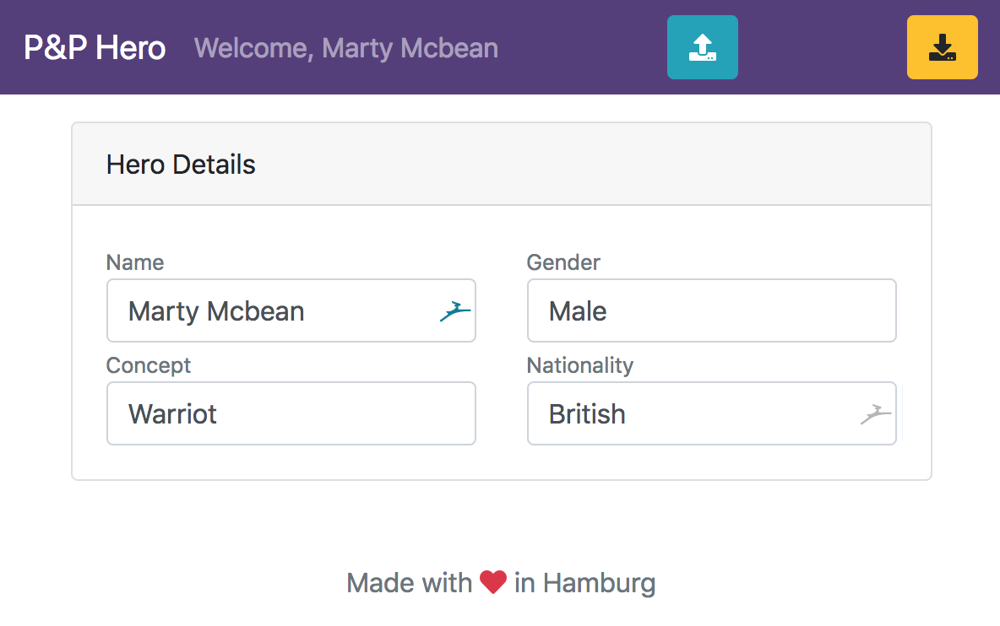

# PenPaper - Hero

## Foreword
As i started playing Pen and Paper i came across the problem to keep my character sheet updated. Therefor i started building this UI as Progressive Web App to keep my character updated without any external dependencies (API, ...).

## Current Features
- Export Hero as JSON to save it on your own
- Saving Hero into Browser Localstorage for persistence

## Development server

Run `ng serve` for a dev server. Navigate to `http://localhost:4200/`. The app will automatically reload if you change any of the source files.

## Current State

